# hexOS Views Architecture - Mermaid Diagrams

This document contains Mermaid diagrams describing the 4 main views of hexOS and their interconnections.

---

## Overview Diagram - All Views Connected

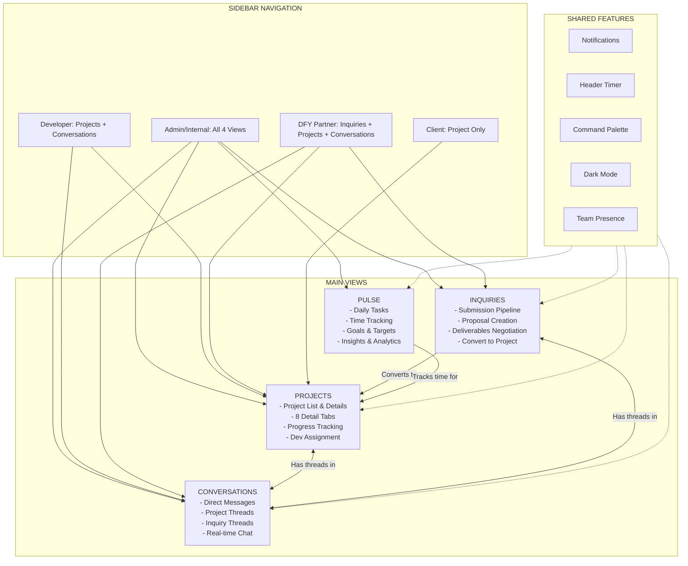

---

## 1. PROJECTS View

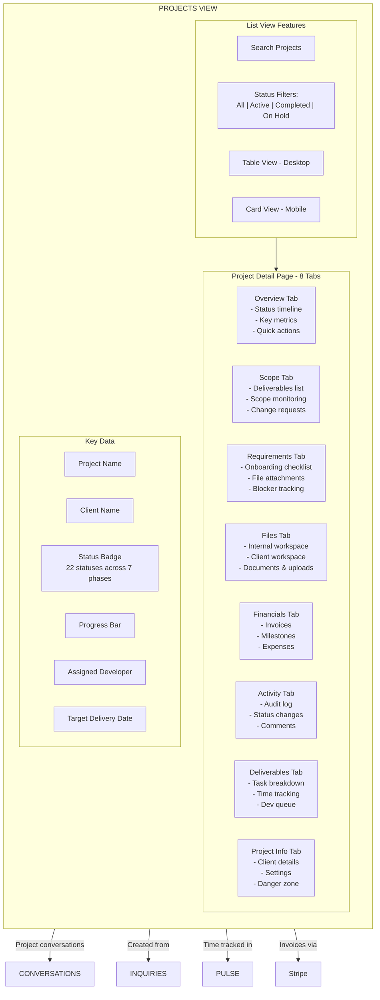

### Project Status Flow

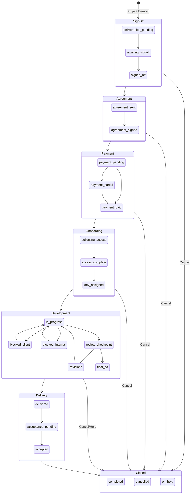

---

## 2. INQUIRIES View

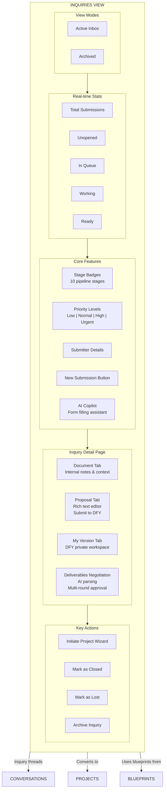

### Proposal Pipeline Flow

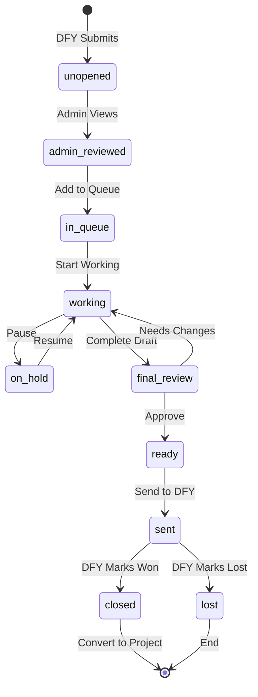

### Deliverables Negotiation Flow

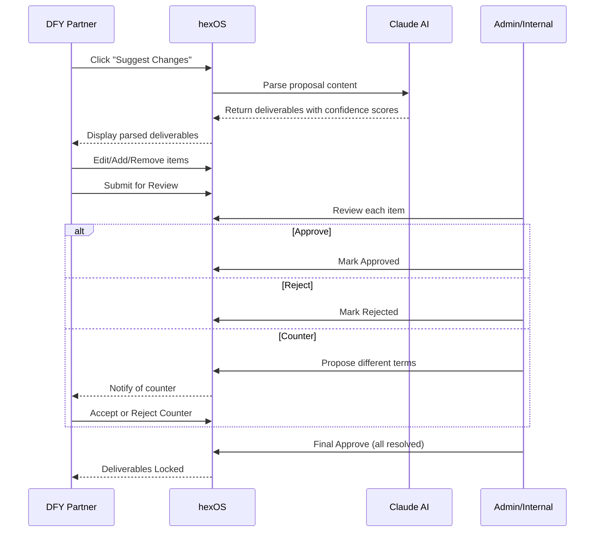

---

## 3. CONVERSATIONS View

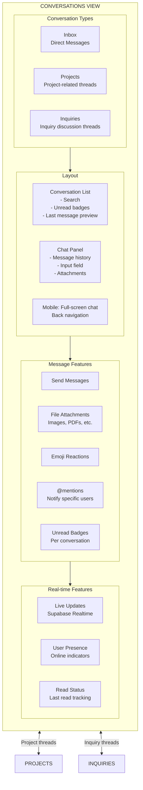

### Message Flow

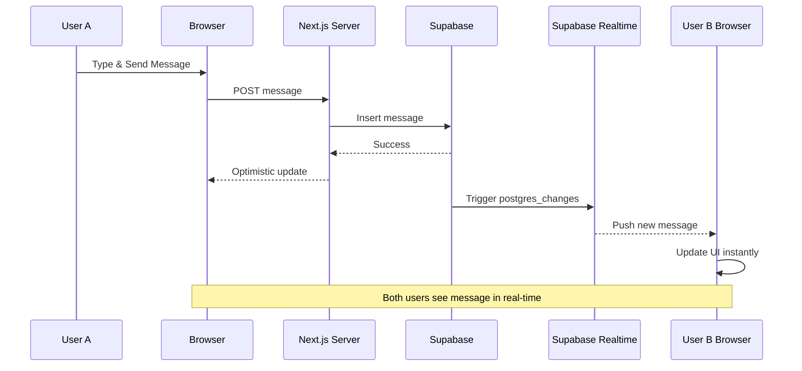

---

## 4. PULSE View (Admin/Internal Only)

```mermaid
flowchart TB
    subgraph PulseView["PULSE VIEW"]
        direction TB

        subgraph TodayTab["Today Tab"]
            DailyScore["Daily Score Ring\nProgress toward 25 pts goal"]
            FocusTasks["Focus Tasks\nTop 3 must-do items\n10 pts each"]
            RegularTasks["Regular Tasks\n3 pts each"]
            ActiveTimer["Active Timer\nStart/Stop tracking"]
            QuickCapture["Quick Capture\nCmd+K to add tasks"]
        end

        subgraph WeekTab["Week Tab"]
            WeeklyHeatmap["12-Week Heatmap\nGitHub-style contribution graph"]
            DayColumns["Day-by-Day View\nMon-Sun task overview"]
            WeeklyProgress["Weekly Progress\nvs Last Week comparison"]
            WeeklyReview["Weekly Review\nMonday reflection prompt"]
        end

        subgraph GoalsTab["Goals Tab"]
            YearlyGoal["Yearly Goal\nCompany-wide target"]
            QuarterTargets["Quarter Targets\nQ1-Q4 breakdown"]
            Actions["Actions\nSteps to complete targets"]
            TargetHealth["Health Scores\nOn track | At risk | Blocked"]
        end

        subgraph InsightsTab["Insights Tab"]
            StreakStats["Streak Stats\nCurrent, longest, average"]
            PersonalRecords["Personal Records\nBest day, week, month"]
            TaskCompletion["Task Completion Chart\nSame day vs rolled vs abandoned"]
            WeeklySummary["Weekly Summary\nThis week vs last week"]
        end
    end

    TodayTab --> WeekTab
    WeekTab --> GoalsTab
    GoalsTab --> InsightsTab

    %% External connections
    PulseView -->|"Time entries for"| ProjectsView["PROJECTS"]
    PulseView -->|"Timer shown in"| GlobalHeader["Global Header"]
```

### Points System

```mermaid
flowchart LR
    subgraph Earn["Earn Points"]
        CompleteTask["Complete Task: 3 pts"]
        CompleteFocus["Complete Focus Task: 10 pts"]
        CompleteLinked["Complete Linked Task: 15 pts"]
        CompleteAction["Complete Action: 10 pts"]
        CompleteTarget["Complete Target: 25 pts"]
        AdvanceDeliverable["Advance Deliverable: 8 pts"]
        CompleteRequirement["Complete Requirement: 5 pts"]
    end

    subgraph Track["Track Progress"]
        DailyTotal["Daily Total"]
        WeeklyTotal["Weekly Total"]
        LifetimeXP["Lifetime XP"]
        CurrentStreak["Current Streak"]
    end

    subgraph Levels["Level Up"]
        L1["Level 1: Rookie\n0 XP"]
        L10["Level 10: Rising Star\n5,000 XP"]
        L25["Level 25: Expert\n12,500 XP"]
        L50["Level 50: Godlike\n25,000 XP"]
    end

    Earn --> Track
    Track --> Levels
```

### Streak Logic

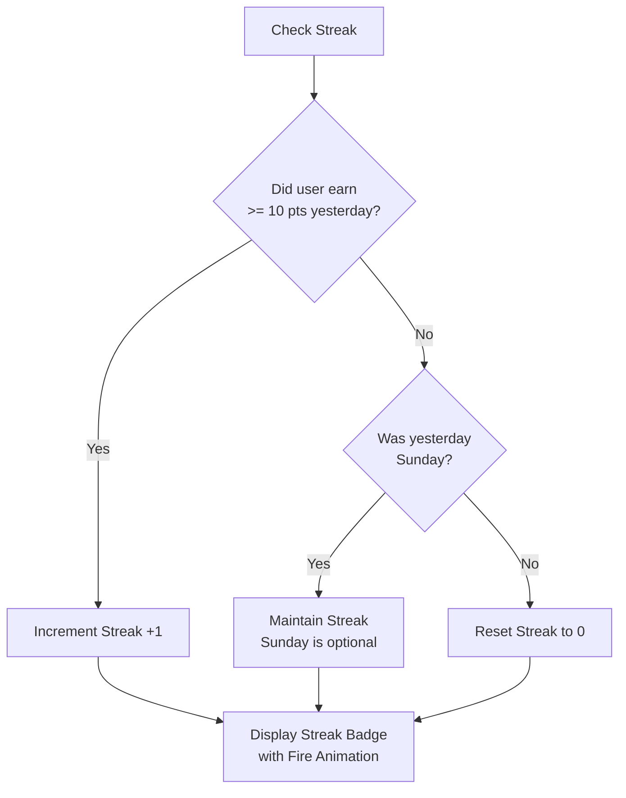

---

## Data Flow Between Views

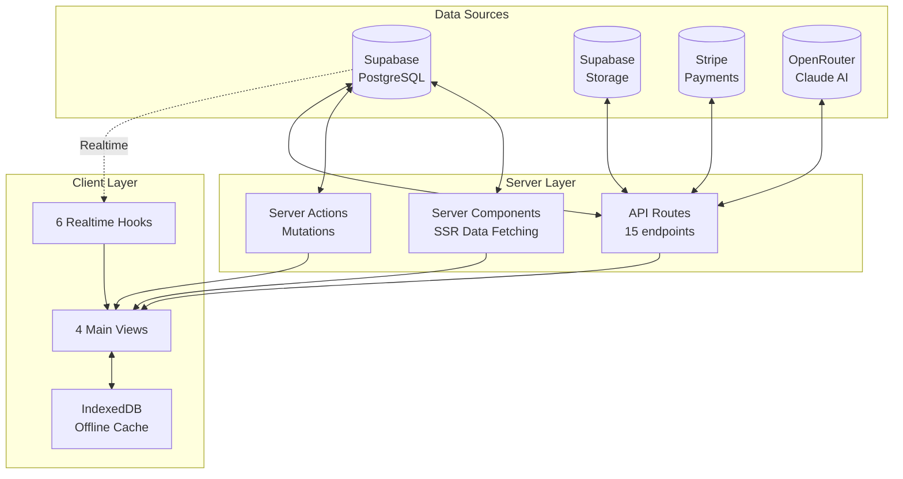

---

## Role-Based View Access Matrix

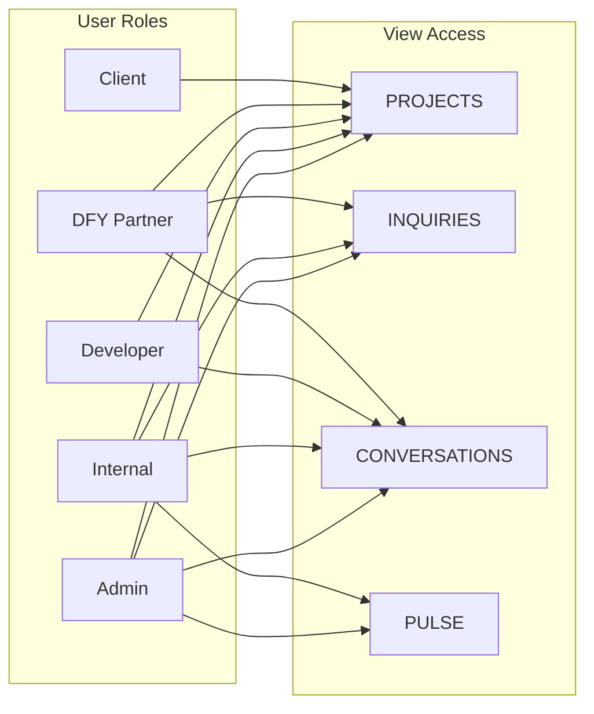

---

## Navigation Structure

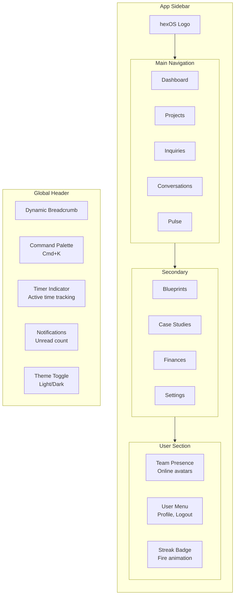

---

## File Locations

| Component | Path |
|-----------|------|
| Projects View | `/app/(dashboard)/projects/page.tsx` |
| Project Detail | `/app/(dashboard)/projects/[id]/page.tsx` |
| Inquiries View | `/app/(dashboard)/inquiries/page.tsx` |
| Inquiry Detail | `/app/(dashboard)/inquiries/[id]/page.tsx` |
| Conversations View | `/app/(dashboard)/conversations/page.tsx` |
| Pulse View | `/app/(dashboard)/pulse/page.tsx` |
| App Sidebar | `/components/app-sidebar.tsx` |
| Realtime Hooks | `/hooks/use-*-realtime.ts` |

---

## Technology Stack Per View

| View | Key Technologies |
|------|------------------|
| **Projects** | Server Components, Tabs, Progress bars, Status badges, DataTable |
| **Inquiries** | Plate.js editor, AI Copilot, Pipeline stages, Form wizard |
| **Conversations** | Supabase Realtime, Message reactions, File attachments |
| **Pulse** | cal-heatmap, Recharts, Timer controls, Drag-and-drop |

---

*Generated: 2026-01-09*
*hexOS v1.0*
